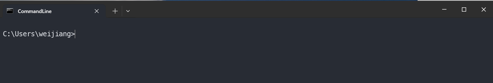

# Managing Python Environments with Conda

If you have multiple python environments for different projects or courses, you can use Conda to manage and switch between them. It works similarly for This page will guide you through the installation and tell you how to switch environments and install packages. Online version [here](https://www.notion.so/Managing-Python-Environments-with-Conda-19f44b73854b80798282eee8fa6ea15f?pvs=21).

### What is a command line interface (CLI) and how to get it?

A command line interface (sometimes known as shell) is a window where you type text commands to interact with the system.

Windows is installed with Command Prompt, you can open it by pressing `Win` key and search `cmd`, or press `Win + R`  and then type `cmd` to run

Windows now has a more friendly version called [Windows Terminal](https://apps.microsoft.com/detail/9n0dx20hk701?hl=en-US&gl=US), you can find it in Microsoft Store. To open it, you can press `Win` and search `wt` or press `Win + R`  and then type `wt` and run

Mac and Linux are installed with multiple shells (e.g., Bash), and the app is called “Terminal” in both systems, you can search in the app launcher and open it.

It will looks like this (this is Windows Terminal, others will be similar)



If you type `python` then you will launch the system-default python, and enter the interactive mode.

In this mode, you can run python codes


A simple command consists of 

an executable program (like `python`)

arguments: the inputs  to the program (like `course/my_script.py`)

Therefore `python course/my_script.py` will tell python to run the codes in file `my_script.py` in the folder `course`

Note that a space in a command will be used to break the command to pieces, if your file name contains spaces like `my_script (copy).py` and you run 

```bash
python course/my_script (copy).py
```

You will have an error because the command is split into `python`, `course/my_script` and `(copy).py`

Therefore in practice, it is good to avoid using spaces in your file names and folder names, instead, you can use underscore `_` or dash `-`

### Download Installer

Go to [https://www.anaconda.com/download/success](https://www.anaconda.com/download/success) and scroll down to bottom for **Miniconda**

Choose an installer according to your system


If you are using are using Mac with M-Series processors (Apple M2, M4), choose **Apple silicon,** you can find this by clicking the apple logo on top left and “about this mac”

If you are using Linux choose 64-Bit (x86) Installer (e.g., some EPFL virtual desktop that doesn’t look like windows, or the centralized jupyter environment provided by EPFL [noto.epfl.ch](https://www.epfl.ch/education/educational-initiatives/jupyter-notebooks-for-education/one-click-access-to-jupyter-notebooks-online-with-noto/))

### MAC & Linux Run Command Line Installer

- You can also download a file via command line
    
    Hover your mouse on the download link and right click to copy the link
    
    then use `wget` to download the file, run `wget PASTE_THE_LINK` 
    
    Example 
    
    ```bash
    wget https://repo.anaconda.com/miniconda/Miniconda3-latest-MacOSX-arm64.sh
    ```
    
- Command line installation (Linux or MAC)
    
    run `bash THE_FILE_YOU_JUST_DOWNLOADED.sh` 
    
    
    
    Then the installer will show you terms and conditions, you can skip by pressing `q` (for quit)
    
    You can accept the default installation path. 
    
    When asked whether to automatically configure conda, type yes to accept
    
    
    
    After that you can close and reopen the terminal, and run `conda --help` to check
    
    If you see “command not found: conda”
    
    Run in your terminal `~/miniconda3/bin/conda init bash` then restart the terminal
    
    I’m using zsh with anaconda, which are similar to bash and miniconda
    
    
    

### Windows Graphical Installer

- Graphical installation, tick the box “add Anaconda to my PATH …”
    
    
    
    Why it is not recommended: this will make the miniconda python as your new system default, that is, if you type `python` in a terminal, you will launch the miniconda python. If you don’t have application relying on a system default, you can ignore this warning.
    
- In case you didn’t do that.
    
    You can run something similar to Mac and Linux in command line
    
    ```
    .\anaconda3\condabin\conda init cmd.exe
    ```
    
    It it works, no need to do the following.
    
    Open Windows Settings, search for "environment", select **Edit environment variables for your account**, then edit the **Path** variable to include that folder. (for example `C:\Users\weijiang\miniconda3`)
    
    
    
    
    

After that you can open terminal, and run `conda --help` to check

### Select default terminal in VS Code

You can select your default Terminal, so that every time you launch a terminal, it is the one you have configured with conda. On windows you can select Command Prompt


### Using conda to manage python environment

You can find a cheatsheet for conda commands [here](https://docs.conda.io/projects/conda/en/latest/_downloads/843d9e0198f2a193a3484886fa28163c/conda-cheatsheet.pdf) (or google search conda cheatsheet) 

Create a new environment with required python version

```bash
# this command tells conda to create a new environment named (-n) civil127
# and the environment should strictly (==) contain python 3.12.9
conda create -n civil127 python==3.12.9
```

Activate the environment (now `python` will call the python in this environment)

```bash
conda activate civil127
```

Return back to base environment (after activating another environment)

```bash
conda deactivate # or conda activate base
```

Install packages (when you have civil127 activated), using `numpy` as example

```bash
conda install numpy
```

An alternative way is to use `pip` 

```bash
# python -m pip will call the pip of the activated conda environment
# simply using pip will call the system-default pip
python -m pip install numpy
```