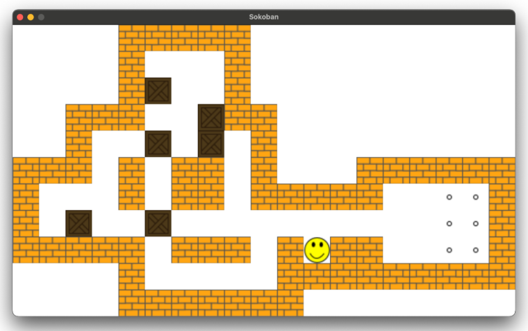

# EPFL CIVIL-127, Lab 4

## Submission Guidelines

This lab is graded. Please upload the solutions to Moodle via [lab 4 upload](https://moodle.epfl.ch/mod/assign/view.php?id=1327903) no later than **Friday, March 14th, 2025, 6pm**.

The submission should be a zip file with your solutions structured as follows:
```
civil-127/exercise_4_1/
civil-127/exercise_4_2/
civil-127/exercise_4_3/
civil-127/levels/level1.xsb (you can include additional levels if you want)  
civil-127/assets/<various svg files>
```

## Exercise 4.1

Implement a `Cal` class which provides a function to print a calendar’s month view. 
The only import you are allowed to use for this exercise is `datetime`. 
Write tests for this class.
The solution to this exercise should contain the following files:
```
civil-127/exercise_4_1/cal.py (Cal class)
civil-127/exercise_4_1/test_cal.py (TestCal class with tests)
```

`c = Cal()`  
`c.year(2025)`  
`c.month("jan")`  
`c.week_start("sun")`  
`c.print()` should print, with the exact spacing/formatting:

```
    January 2025
Su Mo Tu We Th Fr Sa
          1  2  3  4
 5  6  7  8  9 10 11
12 13 14 15 16 17 18
19 20 21 22 23 24 25
26 27 28 29 30 31
```

`c = Cal()`  
`c.month("aug")`  
`c.year(2025)`  
`c.print()` should print, with the exact spacing/formatting:

```
    August 2025
Mo Tu We Th Fr Sa Su
             1  2  3
 4  5  6  7  8  9 10
11 12 13 14 15 16 17
18 19 20 21 22 23 24
25 26 27 28 29 30 31
```

If the year or month are not set, your `Cal` class should default to the current year and month. 
If `week_start` isn’t called, the default is monday.

You can check `jan_2025.txt` and `aug_2025.txt` in this week's lab folder to ensure you are formatting your output correctly.


## Exercise 4.2

Continue working on your Sokoban from labs 1, 2, and 3 or use one of the solutions from lab 3. The grading will only focus on the new code you are adding for this exercise. Implement checking that the level is completed. The level is completed when all the goals are covered by a box. When the player has completed the level, you can `print(“success”)` and exit your game loop.

Add one or more tests to confirm that you have implemented this new feature correctly. You can test with `level1.xsb` or use you own level for testing purposes.

The solution to this exercise should contain the following files:
```
civil-127/exercise_4_2/sokoban.py (for the sokoban game)
civil-127/exercise_4_2/test_sokoban_model.py (TestSokobanModel class with test cases)
```
You may split the contents of `sokoban.py` to multiple files for clarity.

## Exercise 4.3

Make a copy of your Sokoban from exercise 4.2, and implement a graphical interface for your game using pygame. 
Refer to [this week’s slides](https://moodle.epfl.ch/pluginfile.php/3429025/mod_resource/content/1/epfl_civil_127_slides04.pdf) for additional information about pygame.

Use `pip install pygame==2.6.1` to ensure you have the latest version.
Note: for most Windows users in this class the command would be `<Path/to/python3.12.9/interpreter> -m pip install pygame`. 
You can check the setup by:
```bash
python --version  # shoud return `3.12.9`
pip show pygame # should return `Version: 2.6.1`
```

We have provided icons in the `assets` folder, but you are welcome to create your own graphics.
Once your pygame version of the game works, please cleanup your code and remove any unnecessary parts (e.g. you don’t need code to print the board to stdout, so you can remove that).

Writing tests for this part is optional. 
The solution to this exercise should contain the following files:
```
civil-127/exercise_4_3/sokoban.py (for the sokoban game)
civil-127/exercise_4_3/test_sokoban_model.py (Optional, TestSokobanModel class with test cases)
```
You may split the contents of `sokoban.py` to multiple files for clarity.

Congratulations, you now have a fully functional Sokoban game! Your game should look like:

